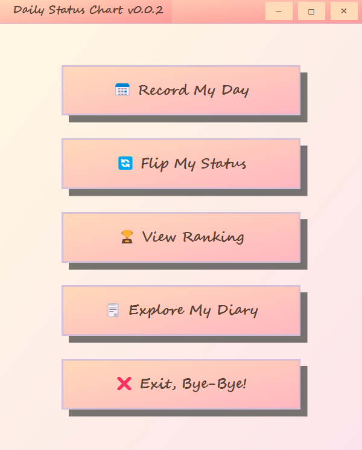
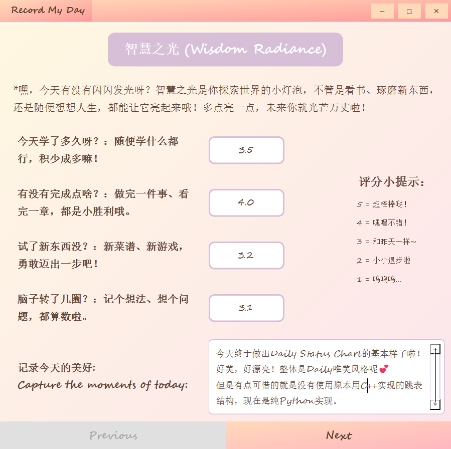
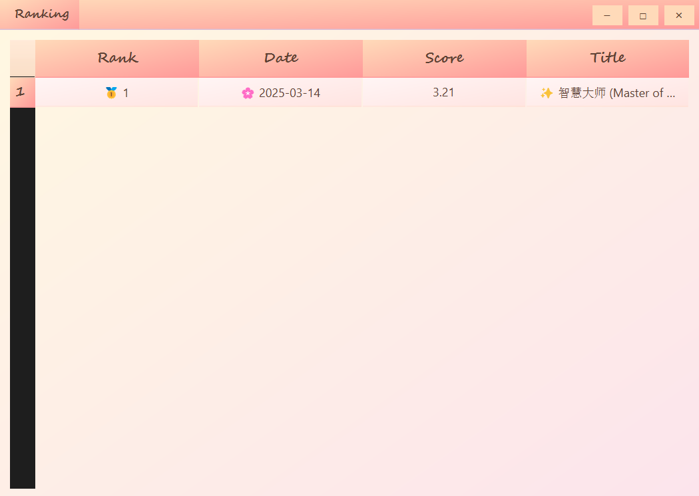
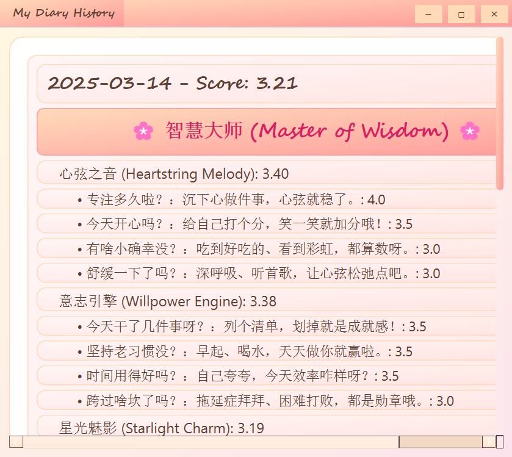
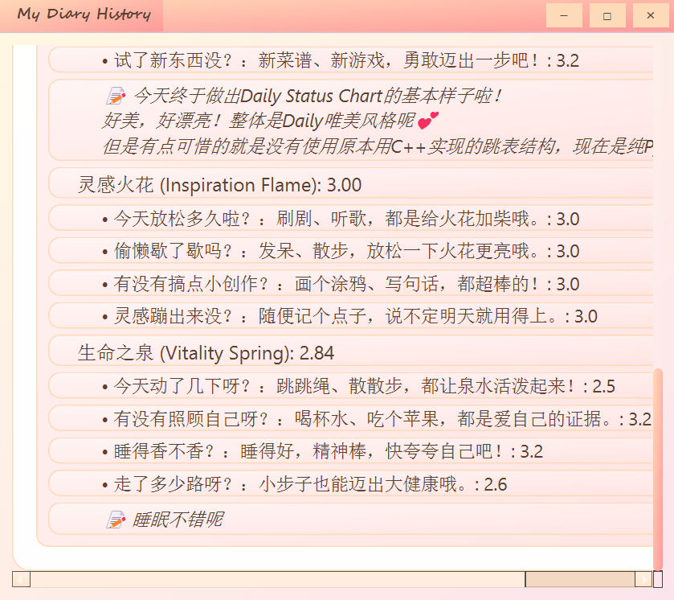

# 📝 Daily Status Chart - 你的成长日记 🌸

> *与其追逐他人的步伐，不如迈过昨日的自己。*  
> *Rather than chasing the footsteps of others, it is better to step over the self of yesterday.*  

欢迎使用 **Daily Status Chart**，一个温馨的小应用，记录你的每日进步，与昨日的自己比较！这个项目帮助你记录每日的分数、属性和事件，并以视觉上愉悦的方式呈现。就像你的个人成长日记，包裹在柔和的粉色调中，点缀着可爱的小图标。💕

## ✨ 功能亮点

- **每日历史视图**：查看过去的记录，包括日期、分数和特别的称号（如 "✨ 活力之王"）。每条记录都像日记中的一页，包含属性、影响因素和难忘的事件。
- **排行榜**：查看你的最高分数排名，表格风格展示，前三名有奖牌（🥇🥈🥉）装饰，其他排名有闪耀星星（🌟）。高分还会带上火焰（🔥）效果！
- **日记风格设计**：柔和的渐变色（从米色 `#FFF8E1` 到浅粉 `#FCE4EC`）、圆润边框和手写字体（`Segoe Script`）让每个界面都充满温暖。
- **可爱动画**：称号和前三名排名轻轻闪烁，颜色在柔和粉色（`#FF9999` 到 `#FFDAB9`）间过渡，增添魔法感而不失优雅。
- **自定义图标**：用 🌸（樱花）、✨（闪耀）、🎉（庆祝）等可爱图标装饰你的记录，让每刻都特别。

## 🖼️ 截图预览

### 主界面


### 记录界面


### 排行榜
- **排名 1**：🥇 1 | 🌸 2025-03-14 | 3.12 | ✨ 活力之王 (King of Vitality)（闪烁行）
- **排名 2**：🥈 2 | 🌸 2025-03-13 | 2.80 | ✨ 灵感之星 (Star of Inspiration)（闪烁行）
- **排名 3**：🥉 3 | 🌸 2025-03-12 | 2.50 | ✨ 努力小熊 (Little Bear of Effort)（闪烁行）
- **排名 4**：🌟 4 | 🌸 2025-03-11 | 2.20 | ✨ 成长新芽 (Sprout of Growth)



### 历史记录

<div style="display: flex; justify-content: space-between; max-width: 100%;">
  
  
</div>

## 🚀 快速开始

### 前置条件

- Python 3.8+
- PyQt6（建议版本 >= 6.2.0，以获得最佳动画支持）
- SQLite（Python 标准库已包含）

### 使用步骤

超简单！下载release中的压缩包，解压后点击.exe文件就可以直接用啦~

or 你想看得更细致可以参考下面的安装步骤：

1. 克隆仓库：
   ```
   git clone https://github.com/yourusername/DailyStatusChart.git
   cd DailyStatusChart
   ```

2. 安装依赖：
   ```
   pip install PyQt6
   ```

3. 运行应用：
   ```
   cd src/python
   python main.py
   ```

## 🎨 设计亮点

- **颜色搭配**：
 - 背景：米色 (`#FFF8E1`) 到浅粉 (`#FCE4EC`)
 - 点缀色：桃色 (`#FFDAB9`) 和樱花粉 (`#FF9999`)
 - 文字：暖棕色 (`#5C4033`) 和深玫红 (`#D81B60`) 用于高亮
- **字体**：
 - `Segoe Script` 用于标题和表头，带来手写日记感
 - `Segoe UI` 用于正文，清晰易读
- **动画效果**：
 - 历史视图中的称号和排行榜前三名以 2 秒周期闪烁，颜色在 `#FFF5F5` 和 `#FF9999` 间过渡。
- **图标**：
 - 🌸 用于日期，✨ 用于称号，🎉 用于事件，💡 用于属性，🔥 用于高分，🥇🥈🥉 用于前三名。

## 🛠️ 项目结构

- **src/python/**: 主 Python 脚本
 - `main.py`: 应用入口
 - `ui/history_dialog.py`: 显示每日历史，采用日记布局
 - `ui/ranking_dialog.py`: 展示排行榜，带闪烁动画
 - `utils/database.py`: SQLite 数据库管理
 - `utils/helpers.py`: 工具函数（如 `apply_gradient_background`, `animate_open`)
- **utils/constants.py**: 常量，如 `DB_PATH` 和 `ICON_DIR`

## 🤝 贡献

欢迎提出问题或提交拉取请求，添加更多日记风格功能、图标或配色方案！让我们一起让这个应用更加温馨。🌟

## 📜 许可证

本项目采用 MIT 许可证 - 详情请见 [LICENSE](LICENSE) 文件。

## 💌 致谢

- 制作灵感源自近期对自我进步的反思。究竟怎么样才算优秀呢？学习无止境，与昨天比进步的你就是最优秀的！
- 画面灵感来源于手写日记的温暖和记录成长的乐趣。
- 感谢 PyQt6 提供了创建美丽动画界面的便利。

快乐记录每一天！🌙